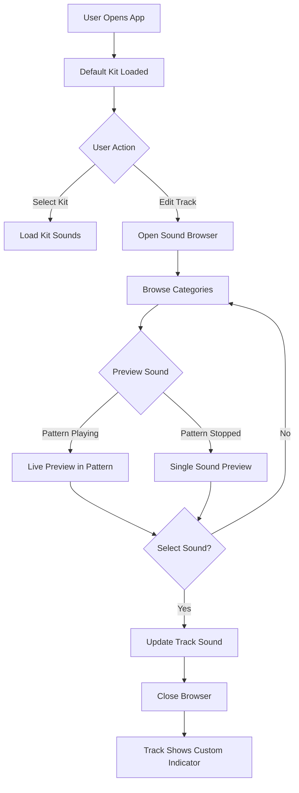

# Product Requirements Document: Drum Kit & Sound Library Feature
## PRD-0001

## 1. Executive Summary

### 1.1 Feature Overview
The Drum Kit & Sound Library feature enables users to select from pre-defined drum kits and customize individual drum sounds within Alpine Beats. This feature transforms the application from a fixed-sound drum machine into a versatile, customizable beat production tool.

### 1.2 Business Objectives
- Increase user engagement through sound customization capabilities
- Expand creative possibilities for beat creation
- Position Alpine Beats as a comprehensive web-based drum machine
- Improve user retention by allowing personalized sound selection

### 1.3 Success Metrics
- User engagement: Average session duration increase of 30%
- Feature adoption: 60% of users try different drum kits within first session
- Customization rate: 40% of users customize at least one sound
- Pattern completion: 25% increase in saved/completed patterns

## 2. User Stories

### 2.1 Primary User Stories

**US-01: Kit Selection**
> As a user, I want to select from different drum kits so that I can quickly change the entire sound palette of my beat.

**Acceptance Criteria:**
- User can see a list of available drum kits
- Selecting a kit instantly updates all 8 track sounds
- Current kit selection is visually indicated
- Kit changes preserve the current pattern

**US-02: Individual Sound Customization**
> As a user, I want to customize individual drum sounds so that I can create my perfect drum kit combination.

**Acceptance Criteria:**
- Each track has an edit/customize button
- Clicking edit opens a sound browser interface
- User can browse sounds by category
- User can preview sounds before selection
- Selected sound replaces the track's current sound

**US-03: Live Sound Preview**
> As a user, I want to preview how different sounds work with my pattern while it's playing so that I can make informed sound choices.

**Acceptance Criteria:**
- Sound browser allows preview during playback
- Pattern continues playing with temporary sound
- User can audition multiple sounds quickly
- Original sound restored if user cancels

## 3. Functional Requirements

### 3.1 Drum Kit Library

**Available Kits:**
| Kit Name | Description | Target Genre |
|----------|-------------|--------------|
| Classic | Acoustic drum kit sounds | Rock, Pop |
| Rock | Punchy, aggressive drums | Rock, Metal |
| Motown | Vintage, warm drum sounds | Soul, R&B |
| Electronic | Synthesized drum sounds | EDM, Techno |
| Hip Hop | Boom-bap and trap sounds | Hip Hop, Rap |
| Jazz | Brushes and light touches | Jazz, Blues |
| Country | Nashville-style drums | Country, Folk |
| TR-808 | Roland TR-808 emulation | Hip Hop, Electronic |
| TR-909 | Roland TR-909 emulation | House, Techno |

**Each Kit Contains 8 Tracks:**
1. Kick/Bass Drum
2. Snare
3. Closed Hi-Hat
4. Open Hi-Hat
5. Clap/Rim (varies by kit)
6. Cymbal/Cowbell (varies by kit)
7. Tom Hi/Percussion 1
8. Tom Lo/Percussion 2

### 3.2 Sound Library Organization

**Sound Categories:**
- **Kicks**: 15-20 variations (sub, punchy, acoustic, electronic)
- **Snares**: 15-20 variations (tight, loose, clap, rim)
- **Hi-Hats**: 10-15 variations (closed, open, pedal)
- **Cymbals**: 8-10 variations (crash, ride, splash)
- **Toms**: 10-12 variations (high, mid, low, electronic)
- **Percussion**: 15-20 variations (cowbell, conga, bongo, shaker, tambourine)
- **FX**: 8-10 variations (laser, sweep, noise, impact)

**Total Library Size**: ~100 unique sounds

### 3.3 User Interface Components

#### 3.3.1 Kit Selector
- **Location**: Top control bar, next to tempo controls
- **Type**: Dropdown menu or styled select
- **Display**: Shows current kit name
- **Behavior**: Instant kit switching on selection

#### 3.3.2 Track Edit Button
- **Location**: Adjacent to each track label
- **Icon**: Pencil/edit icon (✏️)
- **Size**: Small, unobtrusive
- **Behavior**: Opens sound browser for that track

#### 3.3.3 Sound Browser Modal
- **Type**: Modal overlay
- **Components**:
  - Header with track name being edited
  - Category tabs/filters
  - Scrollable sound grid
  - Preview button per sound
  - Select button per sound
  - Current sound indicator
  - Search/filter input (Phase 2)
  - Close/Cancel button

#### 3.3.4 Visual Indicators
- **Customized Track**: Dot or badge on tracks with custom sounds
- **Playing Preview**: Highlight effect during sound audition
- **Selected Sound**: Checkmark or highlight on current sound

### 3.4 Interaction Flow



## 4. Technical Requirements

### 4.1 Data Structure

```javascript
// Sound Library Structure
const soundLibrary = {
  categories: {
    kicks: [
      {
        id: 'kick_classic_1',
        name: 'Classic Kick',
        category: 'kicks',
        tags: ['acoustic', 'punchy'],
        sound: Function // Web Audio synthesis function
      }
    ],
    // ... other categories
  }
};

// Drum Kit Structure
const drumKits = {
  classic: {
    id: 'classic',
    name: 'Classic',
    description: 'Acoustic drum kit',
    tracks: [
      { name: 'Kick', soundId: 'kick_classic_1' },
      // ... 7 more tracks
    ]
  }
};

// Track State Structure
const track = {
  name: 'Kick',
  soundId: 'kick_classic_1',
  sound: Function, // Current sound function
  steps: Array(16), // Pattern data
  customized: false, // Has user customized from kit default
  volume: 1.0, // Future: per-track volume
  muted: false // Future: mute functionality
};
```

### 4.2 Storage Requirements

**LocalStorage Schema:**
```javascript
{
  'alpineBeats.currentKit': 'classic',
  'alpineBeats.customSounds': {
    '0': 'kick_808', // Track index: sound ID
    '2': 'hihat_jazz_1'
  },
  'alpineBeats.savedKits': [ // Future: User-created kits
    {
      name: 'My Custom Kit',
      tracks: [...]
    }
  ]
}
```

### 4.3 Performance Considerations
- Sound synthesis functions should be optimized and cached
- Lazy load sound categories to reduce initial load
- Debounce rapid sound preview changes (100ms)
- Maximum 8 concurrent audio contexts for tracks
- Use Web Audio API scheduling for precise timing

### 4.4 Browser Compatibility
- Web Audio API support required
- Tested on Chrome 90+, Firefox 88+, Safari 14+, Edge 90+
- Mobile Safari requires user interaction for audio context
- Provide fallback for browsers without Web Audio API

## 5. Design Specifications

### 5.1 Visual Design
- **Kit Selector**: Styled dropdown matching app theme
- **Edit Buttons**: Subtle, 20x20px, low opacity until hover
- **Sound Browser**: 
  - Modal: 80% screen width, max 800px
  - Dark theme consistent with main app
  - Sound items: Grid layout, 3-4 columns
  - Preview buttons: Primary color accent
  - Category tabs: Horizontal scroll on mobile

### 5.2 Responsive Design
- **Desktop**: Full modal with grid layout
- **Tablet**: Similar to desktop, 2-3 column grid
- **Mobile**: 
  - Full-screen modal
  - Single column sound list
  - Sticky category tabs
  - Large touch targets (min 44x44px)

### 5.3 Animations
- Modal fade-in: 200ms ease-out
- Sound selection: Brief pulse animation
- Kit change: Subtle flash on track labels
- Preview playing: Pulsing glow effect

## 6. Implementation Phases

### Phase 1: Foundation (Week 1)
- [ ] Create complete sound library with all synthesis functions
- [ ] Implement data structures for kits and sounds
- [ ] Add kit selector UI component
- [ ] Implement basic kit switching functionality

### Phase 2: Sound Browser (Week 2)
- [ ] Build sound browser modal UI
- [ ] Implement category filtering
- [ ] Add sound preview functionality
- [ ] Enable sound selection and track updates

### Phase 3: Live Preview (Week 3)
- [ ] Implement live pattern preview with sound changes
- [ ] Add visual indicators for customized tracks
- [ ] Implement localStorage persistence
- [ ] Add loading states and error handling

### Phase 4: Polish & Optimization (Week 4)
- [ ] Optimize sound synthesis performance
- [ ] Add search/filter functionality
- [ ] Implement keyboard shortcuts
- [ ] Complete mobile optimization
- [ ] User testing and bug fixes

## 7. Future Enhancements

### 7.1 Version 2.0 Features
- **Sound Parameters**: Pitch, decay, filter controls per sound
- **Sound Layering**: Combine multiple sounds on one track
- **User Kits**: Save and name custom kit combinations
- **Kit Sharing**: Export/import kits as JSON files
- **Sample Upload**: Users upload their own WAV/MP3 samples

### 7.2 Version 3.0 Features
- **Sound Packs**: Downloadable expansion packs
- **Cloud Sync**: Save kits and patterns to user account
- **Community Sharing**: Public library of user-created kits
- **MIDI Mapping**: Map sounds to MIDI inputs
- **Effects Chain**: Per-track reverb, delay, distortion

## 8. Success Criteria

### 8.1 Launch Criteria
- All 9 drum kits fully implemented
- Minimum 80 unique sounds in library
- Sound browser loads in <500ms
- Kit switching happens in <100ms
- Zero audio glitches during sound changes
- Mobile responsive on all target devices

### 8.2 Quality Metrics
- No memory leaks after 30 minutes of use
- CPU usage remains below 30% during playback
- All sounds play without clipping or distortion
- UI remains responsive during pattern playback
- LocalStorage usage under 100KB

## 9. Risks & Mitigations

| Risk | Probability | Impact | Mitigation |
|------|------------|--------|------------|
| Browser audio context limits | Medium | High | Implement audio context pooling |
| Sound library size affecting load time | High | Medium | Lazy load categories, optimize functions |
| Mobile browser audio restrictions | High | Low | Clear user interaction prompts |
| Complex UI overwhelming users | Medium | Medium | Progressive disclosure, good defaults |
| Performance issues with many sounds | Low | High | Caching, efficient memory management |

## 10. Testing Requirements

### 10.1 Functional Testing
- Kit switching preserves patterns
- All sounds play correctly
- Sound preview works during playback
- Customizations persist after refresh
- Cancel action restores original sound

### 10.2 Performance Testing
- Page load time <2 seconds
- Kit switch time <100ms
- Sound preview latency <50ms
- No memory leaks over extended use
- Smooth playback with all tracks active

### 10.3 Compatibility Testing
- Desktop browsers (Chrome, Firefox, Safari, Edge)
- Mobile browsers (iOS Safari, Chrome Mobile)
- Different screen sizes (320px to 4K)
- Touch and mouse interactions
- Keyboard navigation

## 11. Documentation Requirements

### 11.1 User Documentation
- Quick start guide for kit selection
- Sound browser tutorial
- Keyboard shortcuts reference
- Troubleshooting guide

### 11.2 Technical Documentation
- Sound synthesis API documentation
- Data structure references
- Contribution guide for new sounds
- Performance optimization guide

## 12. Approval & Sign-off

| Role | Name | Date | Signature |
|------|------|------|-----------|
| Product Owner | | | |
| Tech Lead | | | |
| UX Designer | | | |
| QA Lead | | | |

---

**Document Version**: 1.0  
**Last Updated**: [Current Date]  
**Status**: Draft  
**Next Review**: [Review Date]
